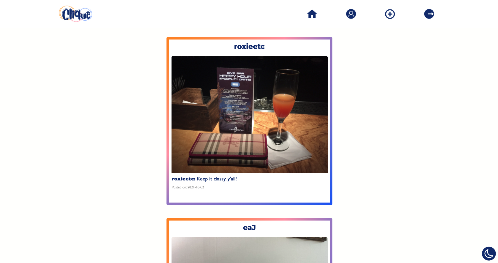
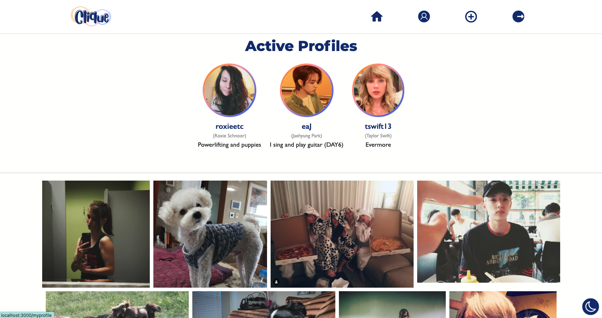
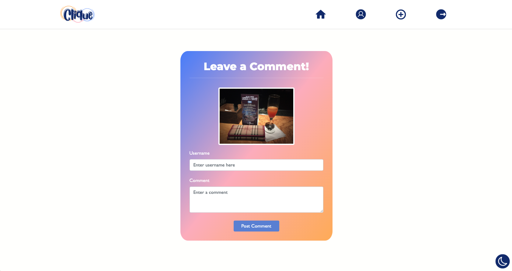
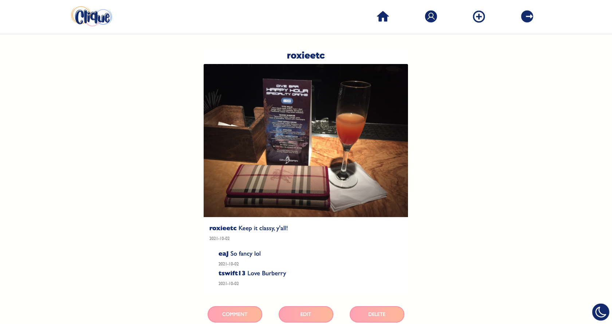

# Clique

Clique is a photo-sharing social media app that applies all the fun aspects of group chatting, but with pictures! You can invite your friends to your account, have them sign up, and then the pictures posted will be exclusive to only you and the friends you have invited.

---

## App Images

---

## Technologies Used

- **Django & SQL**: Backend models and database. Implemented Django REST framework to make database management easier to handle.
- **ReactJS & Bootstrap**: For frontend development and API calls from backend.

---

## Installation Instructions

**FRONTEND**

- Fork and clone this repository.
- Run **`npm i`** followed y **`npm start`** to start the app.

**BACKEND**

- Fork and clone the clique-backend repository.
- Set up vitual environment by running **`pipenv shell`**.
- Run **`python3 manage.py makemigrations`** and then **`python3 manage.py migrate`** to create database.
- Finally, use **`python3 manage.py runserver`** to start the server.

---

## User Stories

- As a user, I would like to be able to post, edit, and delete pictures from the account.
- As a user, I would like to be able to comment on other pictures and accounts so that I can interact with other users.
- As a user, I would like to have my own account, so that I can have pictures linked to my acocunt.

---

## Unsolved Problems

- **Unsolved Problems**: Getting dark mode to function throughout the app is something I simply just did not have enough time to work through by the deadline. Other problems that need fixing are redirect issues and reverse mapping issues.
